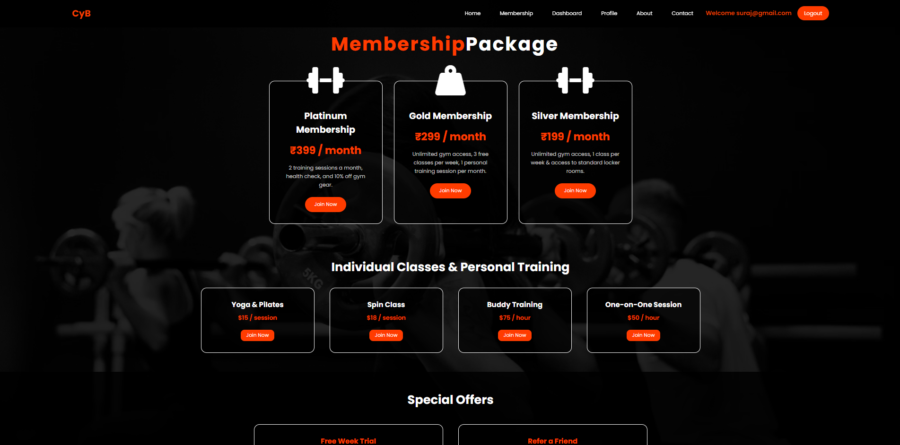

# 🏋️ Gym Management System

A stylish and responsive **Gym Management Web Application** built to manage gym memberships, trainers, payments, user profiles, and admin controls. The system provides a smooth experience for users to register, login, buy or update membership plans, select trainers, and manage their fitness journey.

---

## 📸 Screenshots

> Add your project screenshots inside a folder named `screenshots` and update the image paths below.

### Home Page


### Dashboard Page


### Membership Plans



### Admin Dashboard


---

## ✨ Features

### 👤 User Features

* User registration and login
* Secure authentication using **Spring Security**
* View available membership plans
* Buy gym plans:

  * Silver
  * Gold
  * Platinum
* Select trainer
* Make payment
* Update membership plan
* Edit user profile
* Access user dashboard after login
* Fully responsive design for mobile, tablet, and desktop

### 🛠️ Admin Features

* Admin login using the same login page
* Admin dashboard
* Manage all users
* Update membership plan prices
* View and control gym management data

---

## 📄 Pages Included

* Home Page
* Dashboard Page
* Membership Plan Page
* About Page
* Contact Page
* Login Page
* Registration Page
* Admin Dashboard Page

---

## 🧰 Tech Stack

* **Java**
* **Spring Boot**
* **Spring Security**
* **Thymeleaf**
* **HTML5**
* **CSS3**
* **JavaScript**
* **MySQL / Database**
* **Bootstrap / Responsive Design**

---

## 🔐 Authentication

The project uses **Spring Security** for secure login and registration.

After successful login:

* Normal users are redirected to the user dashboard
* Admin users are redirected to the admin dashboard

---

## 💳 Membership Plans

Users can choose from different gym plans:

| Plan     | Description                                           |
| -------- | ----------------------------------------------------- |
| Silver   | Basic gym membership plan                             |
| Gold     | Advanced plan with extra benefits                     |
| Platinum | Premium plan with trainer sessions and extra features |

Admin can update the price of each plan from the admin dashboard.

---

## 📱 Responsive Design

The application is designed with a modern and stylish UI.
It works smoothly on:

* Desktop screens
* Tablets
* Mobile phones

---

## 🚀 How to Run the Project

1. Clone the repository

```bash
git clone https://github.com/your-username/your-repo-name.git
```

2. Open the project in your IDE

3. Run the Spring Boot application

```bash
mvn spring-boot:run
```

4. Open the app in your browser

```bash
http://localhost:8080
```

---

## 📂 Project Structure

```bash
## 📂 Project Structure

```text
construct_your_body/
│
├── src/main/java/
│   ├── com.cyb
│   │   ├── ConstructYourBodyApplication.java
│   │
│   ├── com.cyb.config
│   │   └── SecuritConfig.java
│   │
│   ├── com.cyb.controller
│   │   ├── AdminController.java
│   │   └── UserController.java
│   │
│   ├── com.cyb.customSuccessHandler
│   │   └── CustSuccessHandler.java
│   │
│   ├── com.cyb.entity
│   │   ├── User.java
│   │   ├── Planrate.java
│   │   ├── ActiveMemberDetails.java
│   │   └── MemberShipPaymentDetail.java
│   │
│   ├── com.cyb.service
│   │   ├── AdminService.java
│   │   └── UserService.java
│   │
│   └── com.cyb.service.impl
│       ├── AdminServiceImpl.java
│       └── UserServiceImpl.java
│
├── src/main/resources/
│   │
│   ├── static/
│   │   ├── admin_css/
│   │   ├── user_css/
│   │   ├── js/
│   │   ├── user_js/
│   │   └── index.css
│   │
│   └── templates/
│       ├── admin/
│       ├── user/
│       ├── index.html
│       └── login.html
│
├── screenshots/
│   ├── home-page.png
│   ├── dashboard.png
│   ├── membership-plans.png
│   ├── admin-dashboard.png
│   └── mobile-view.png
│
├── pom.xml
└── README.md
```

### Architecture Overview

* **Controller Layer** → Handles user requests and page navigation.
* **Service Layer** → Contains business logic for users, memberships, and admin operations.
* **Entity Layer** → Stores database models such as Users, Membership Plans, Active Members, and Payment Details.
* **Security Layer** → Spring Security authentication and authorization.
* **Custom Success Handler** → Redirects Admin and Users to their respective dashboards after login.
* **Frontend Layer** → Thymeleaf templates with responsive HTML, CSS, and JavaScript.

```

---

## 🎯 Future Improvements

* Online payment gateway integration
* Attendance tracking
* Trainer scheduling system
* Email notifications
* Workout and diet plan management
* Membership expiry alerts

---

## 🙋‍♂️ Author

**Your Name**

GitHub: [your-github-profile](https://github.com/your-username)

---

## ⭐ Support

If you like this project, give it a ⭐ on GitHub!
